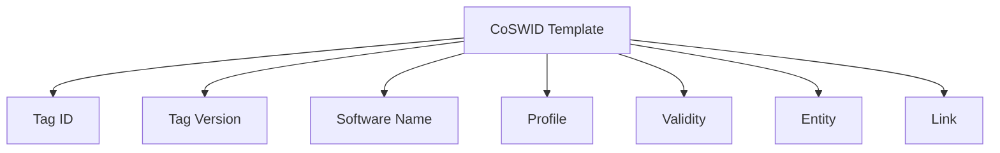

# CoSWID Template Format

## Introduction
**CoSWID stands for Concise Software Identification Tag, a structured format for representing software identification information in a compact manner.**
**CoSWID is designed to facilitate software identification in various contexts, including software inventory management, compliance verification, and security assessments.**

## Conceptual Overview
### What Is CoSWID?
**CoSWID is a data model that captures essential attributes of software identification, which might include:**

- **Tag ID:** A unique identifier for the software.
- **Tag Version:** The version of the CoSWID.
- **Software Name:** The name of the software being identified.
- **Profile:** A URI that identifies the specification or profile associated with the CoSWID.
- **Validity:** The time period during which the CoSWID is considered valid.
- **Entity:** Metadata describing organizations or roles involved in the software's lifecycle.
- **Links:** References to related resources or manifests.

### CoSWID in Software Management
**In software management contexts, CoSWID provides a standardized way to represent software components, allowing for:**

- **Efficient Identification:** Compact representation of software metadata.
- **Interoperability:** Compatibility with existing software identification standards.
- **Enhanced Security:** Facilitating trust and verification processes in software supply chains.

## Template Structure
**A CoSWID template is typically represented in JSON for human-friendly editing.**
**At a minimum, it includes tag-id (a unique identifier).**
**Optional fields like tag-version, software-name, profile, validity, entity, and link provide deeper context:**

```json
{
    "tag-id": "<uuid>",
    "tag-version": <integer>,
    "software-name": "<software-name>",
    "profile": "<profile-uri>",
    "validity": {
        "not-before": "<datetime>",
        "not-after": "<datetime>"
    },
    "entity": [ ... ],
    "link": [ ... ]
}
```

## Top-Level Fields
- **tag-id (String/UUID):** A globally unique identifier for the CoSWID.
- **tag-version (Integer):** The version of the CoSWID.
- **software-name (String):** The name of the software being identified.
- **profile (String, optional):** A URI referencing a particular standard or specification.
- **validity (Object, optional):** A time window (not-before / not-after) during which the CoSWID is valid.
- **entity (Array, optional):** An array of organizations or roles involved in the software's lifecycle.
- **link (Array, optional):** References to related resources or manifests.

## Key Components
### Tag ID
- **Type:** String (UUID)
- **Description:** A unique identifier for the CoSWID.
- **Example:** "123e4567-e89b-12d3-a456-426614174000"

### Tag Version
- **Type:** Integer
- **Description:** The version of the CoSWID.
- **Example:** 0

### Software Name
- **Type:** String
- **Description:** The name of the software being identified.
- **Example:** "Example Software"

### Profile
- **Type:** String (URI)
- **Description:** A URI that identifies the specification or profile associated with the CoSWID.
- **Example:** "http://example.com/cosmid/profile/1"

### Validity
- **Type:** Object
- **Fields:**
    - **not-before:** The earliest valid timestamp for using this CoSWID.
    - **not-after:** The expiry timestamp after which the CoSWID is invalid.

### Entity
- **Type:** Array of Objects
- **Purpose:** Identifies the organizations or individuals related to the software.
- **Fields:**
    - **entity-name:** Human-readable name of the entity.
    - **reg-id:** A registration/domain identifier (e.g., https://example.com).
    - **role:** Array of roles (e.g., [ "tag-creator" ]).

### Link
- **Type:** Array of Objects
- **Purpose:** References to related resources or manifests.
- **Fields:**
    - **href:** A URI pointing to the related resource.
    - **thumbprint:** An object containing hash information for integrity verification.
    - **hash-alg-id:** The identifier for the hash algorithm used.
    - **hash-value:** The computed hash value.

## Additional Files Overview
### coswid-example.json
- **Purpose:** Provides a basic example of a CoSWID structure.
- **Key Fields:**
    - **tag-id:** "123e4567-e89b-12d3-a456-426614174000"
    - **software-name:** "Example Software"
    - **validity:** Specifies the valid time frame.

### coswid-full.json
- **Purpose:** Contains a comprehensive CoSWID structure with additional fields.
- **Key Fields:**
    - **Includes all fields from coswid-example.json plus:**
    - **link:** References to related resources with thumbprint for integrity.

### coswid-meta-full.json
- **Purpose:** Contains metadata related to the signing of the CoSWID.
- **Key Fields:**
    - **signer:** Information about the entity that signed the CoSWID.
    - **validity:** Similar to the main CoSWID, indicating the validity period.

### coswid-meta-mini.json
- **Purpose:** A simplified version of the metadata file.
- **Key Fields:**
    - **signer:** Basic information about the signing entity without detailed validity.

### coswid-schema.json
- **Purpose:** Defines the JSON schema for validating CoSWID files.
- **Key Features:**
    - **Specifies the structure and types of each field in the CoSWID.**
    - **Ensures compliance with the CoSWID format.**

## Detailed Field Descriptions
### Validity Object
- **Fields:**
    - **not-before:** The date and time when the CoSWID becomes valid.
    - **not-after:** The date and time when the CoSWID expires.

### Entity Array
- **Example:**
```json
"entity": [
    {
        "entity-name": "Example Ltd.",
        "reg-id": "https://example.com",
        "role": ["tag-creator"]
    }
]
```

### Link Array
- **Example:**
```json
"link": [
    {
        "href": "https://parent.example/rims/ccb3aa85-61b4-40f1-848e-02ad6e8a254b",
        "thumbprint": {
            "hash-alg-id": 1,
            "hash-value": "5Fty9cDAtXLbTY06t+l/No/3TmI0eoJN7LZ6hOUiTXU="
        }
    }
]
```

## Use Cases
### Software Inventory Management
- **Description:** CoSWID can be used to maintain an accurate inventory of software assets within an organization.
- **Benefits:**
    - **Simplifies tracking of software versions and compliance.**
    - **Enhances visibility into software usage and licensing.**

### Compliance Verification
- **Description:** Organizations can use CoSWID to demonstrate compliance with software licensing and regulatory requirements.
- **Benefits:**
    - **Provides a clear audit trail of software identification.**
    - **Facilitates easier reporting and verification processes.**

### Security Assessments
- **Description:** CoSWID aids in assessing the security posture of software components.
- **Benefits:**
    - **Enables identification of vulnerabilities in software dependencies.**
    - **Supports risk management and mitigation strategies.**

## Best Practices
### Consistent Use of UUIDs
- **Always use UUIDs for tag-id to ensure uniqueness across different systems.**

### Regular Updates
- **Keep the CoSWID files updated with the latest software versions and metadata.**

### Validation Against Schema
- **Validate CoSWID files against the provided JSON schema to ensure compliance with the expected format.**

## Conclusion
**The CoSWID template format provides a robust framework for software identification, ensuring that essential metadata is captured in a standardized manner.**
**By adhering to this structure, organizations can enhance their software management practices, improve compliance, and facilitate better security measures.**

**For further details, please refer to the official CoSWID specification or the relevant documentation associated with this repository.**

## References
- [**CoSWID Specification**](https://datatracker.ietf.org/doc/rfc9393/)

## Visual Overview

